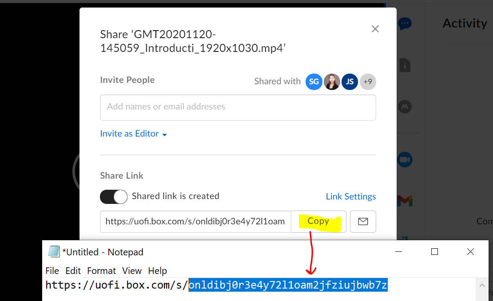
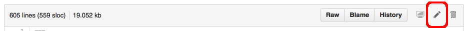

# The Digital Scholarship Hub Workshop Template

## How to use this template to set up a new workshop repository:

1.  Log in to GitHub.
    You must be logged in for the remaining steps to work.

2.  On this page (<https://github.com/carpentries/workshop-template>),
    click on the green "Use this template" button (top right). **Please _do not fork this repository directly on GitHub._**

3.  Choose UIC Libray as the owner for the repository UNLESS you are just  practicing or playing with the repository (Only Admins can delete repository's in the UIC Library's organization)

4. Please *do your work in the repository's `gh-pages` branch*, since that is what is automatically published as a website by GitHub.

5.  Please make the repository public internally to UIC Library, leave "Include all branches" unchecked, and click on "Create repository from template". You will be redirected to your new copy of the workshop template respository.

6. Read through the [Carpentries Lesson Example](https://carpentries.github.io/lesson-example/) to get an idea of how GitHub Pages works, Markdown styling and GitHub, and basics of how our template works (\*Note, some of the information is NOT relevant to our template setup. Specifically, DO NOT run the `bin/lesson_initialize.py` file as instructed in several places. This has been replaced by GitHub's "Use this template" feature.)
    - The GitHub, Markdown, and Jekyll, Lesson Organization, Formatting, Style Guide sections will be the most useful.

## Customizing Your Website (Required Steps)

Before you begin developing your new lesson,
here are a few things you need to do:

* [ ] Decide on a title for your new lesson!
  Once you've chosen a new title, you can set the value for `lesson_title`
  in [`_config.yml`](_config.yml) \*Note: you do not need to edit anything
  else in this file for the time being. 
* [ ] Add the URL to your built lesson pages to the repository description\*
* [ ] [Add relevant topic tags to your lesson repository][cdh-topic-tags].
* [ ] make copies to match the number of parts your workshop will have by creating
  copies of `\_episodes/01-introduction.md`. Files should be named according to 
  convention: `0X-short-title.md`.
* [ ] add content to "episode" pages, and style with markdown (see [Carpentries Lesson Example](https://carpentries.github.io/lesson-example/) for styling this template
* [ ] add images for your workshop content to the `fig` folder. Good convention
  is naming each image according to the episode file it's located in `0X-short-description.png`
    \*Note: you can use png and jpeg files, but they are case sensitive, so if your file is .PNG 
    make sure to use .PNG in the markdown image link. 
* [ ] add other workshop files to the `files` folder (i.e. data files, script files) \*large data files will need to be zipped or linked to outside source, file size limit is 25 MB. 
* [ ] Fill in any remaining fields marked `FIXME` in:
  * index.md
  * 00-setup.md
  * reference.md
* [ ] add the workshop recording by navigating to where it's located in Box, copy the ID from the video sharelink (see image below) and paste into the BoxId field in the yaml in index.md

  * Alternatively, if there is no recording ready to post, comment out the recording section with `` and `` until there is a recording to add.

\*Your new website will be rendered at `https://uic-library.github.io/<workshop-repo-name>`. *To set the URL on GitHub, click the gear wheel button next to About on the right of the repository landing page. You will have to manually enter the url even though a repository at https://github.com/uic-library/workshop-repo-name/ will render automatically at the URL https://uic-library.github.io/<workshop-repo-name>.

## Optional but Recommended Steps
* [ ] Update this README with relevant information about your workshop (see example below)
  and delete this section
* [ ] delete the images in fig related to the README
* [ ] Update the `_extras/further-resources.md`

## Ways to edit in GitHub

There are two ways of customizing your website. You can either:

- edit the files directly in GitHub using your web browser
- clone the repository on your computer and update the files locally

### Updating the files on GitHub in your web browser

1.  Go into your newly-created repository, ensure you are on the gh-pages branch by clicking on the branch under the drop
    down in the menu bar (see the note below):

    
2. Use the pencil icon to go into editing mode and make your edits:
    

\*Note working on your workshop online is prone to losing edits due to internet outages. Either save very frequently, or edit locally.

### Working locally

#### Command Line

If you are already familiar with Git, you can clone the repository to your desktop, edit your workshop locally, and push your changes back to the repository.

```shell
git clone https://github.com/uic-library/workshop-repo-name/
```

In order to view your changes once you are done editing, if you have bundler installed (see the
[installation instructions](https://docs.github.com/en/pages/setting-up-a-github-pages-site-with-jekyll/testing-your-github-pages-site-locally-with-jekyll), you can preview your site locally with:

```shell
make serve
```
for Macs or 

```shell
bundle exec jekyll serve
```
for Windows

and go to <http://localhost:4000> to preview your site.

If there are any issues with the edits you made, you will get an error message from jekyll. [See common jekyll error messages here](https://docs.github.com/en/pages/setting-up-a-github-pages-site-with-jekyll/troubleshooting-jekyll-build-errors-for-github-pages-sites#file-does-not-exist-in-includes-directory) to help with troubleshooting.  

Once you are satisfied with the edits to your site, commit and push the changes to your repository.
A few minutes later, you can go to the GitHub Pages URL for your workshop site and view it. 

#### GitHub Desktop App

Alternatively, you can [download and install the GitHub Desktop application](https://desktop.github.com/), though you won't be able to preview edits as you would with the command line. 

\* Highly recommend becoming comfortable using Git in command line at least for adding, commiting, previewing, and pushing changes. It can take a long time for a push to load on GitHub oneline and to be able to see the change to the website.  


---------------------------

FIXME (other info that should go in the readme?)

## Description:
FIXME

## State of Workshop:
Still in development? Any major fixes to do?

## Creator(s)
FIXME (original creator)
FIXME
FIXME

This workshop was created using the template at https://github.com/uic-library/workshop-template 
